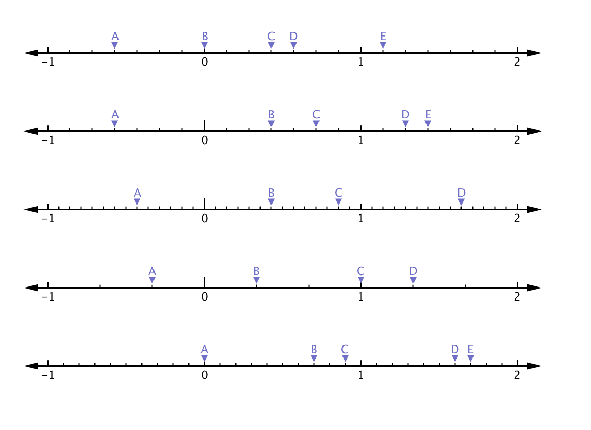

Number Lines
============

Number Lines is a quick processing sketch I wrote to produce number lines with random intervals and markers.
It was written to assist in training to name specific numbers in fractions and in decimal form.

It will create 5 lines at once. To generate 5 new ones just click anywhere on the canvas.

